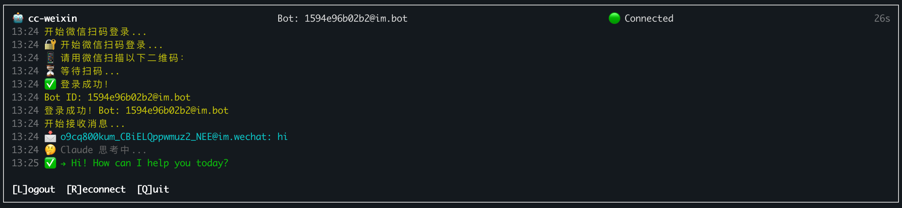

# cc-weixin

**在微信里使用 Claude Code Agent — 基于腾讯官方 iLink Bot API**

> **WIP** — 本项目目前还在早期开发阶段，是一个 demo 级的项目。很多配置能力还待添加，欢迎贡献和提 Issue。



---

## 背景：微信首次合法开放个人 Bot API

2026 年，腾讯通过 [OpenClaw](https://docs.openclaw.ai)（AI Gateway 框架）正式开放了微信个人账号的 Bot API。官方名称叫**微信 ClawBot 插件功能**，底层协议叫 **iLink**（智联），接入域名是 `ilinkai.weixin.qq.com` — 腾讯的官方服务器。

这是历史性时刻。在此之前，开发者想让程序控制微信，只有灰色地带的选项：

| 方式 | 典型实现 | 性质 |
|---|---|---|
| 逆向 iPad 协议 | WeChatPadPro、itchat | 灰色地带，违反协议，随时封号 |
| PC 客户端 Hook | 注入 DLL、内存读写 | 违法，高封号风险 |
| 企业微信 API | 官方开放，但只面向企业 | 合法，但不是"微信" |

**现在不同了。** iLink Bot API 是腾讯官方产品，有《微信ClawBot功能使用条款》法律文件背书，签订地为深圳市南山区，适用中国大陆法律。协议设计为标准 HTTP/JSON，无需 SDK，可直接 `fetch` 调用。

> 完整协议分析见 [weixin-bot-api.md](./weixin-bot-api.md)

---

## 这个仓库是什么

**cc-weixin** 是一个独立的微信 Claude Code Agent 桥接器。它做的事情非常简单：

1. 通过 iLink Bot API 接收微信消息
2. 把消息转发给 Claude Code Agent（带完整工具能力：Bash、文件读写、Web 搜索等）
3. 把 Claude 的回复发回微信

不依赖 OpenClaw 框架，纯 Node.js，~200 行核心代码。

### 实际效果

> 用户发：「告诉我现在我是什么电脑，什么电量」
>
> Claude 调用 Bash 执行 `system_profiler`、`pmset -g batt`，回复了完整的机型 + 电量信息。

这不是一个普通的聊天机器人 — Claude Code Agent 拥有完整的工具调用能力，能在你的机器上执行命令、读写文件、搜索网页，然后把结果发回微信。

---

## 快速开始

### 前置条件

- Node.js >= 22
- [Anthropic API Key](https://console.anthropic.com/)（或兼容的 API 代理）

### 方式一：npx 直接运行（推荐）

```bash
npx cc-weixin
```

### 方式二：全局安装

```bash
npm install -g cc-weixin
cc-weixin
```

### 方式三：克隆源码

```bash
git clone git@github.com:hao-ji-xing/cc-weixin.git
cd cc-weixin
npm install
npm start
```

### 配置

创建 `.env` 文件（放在运行目录下）：

```env
ANTHROPIC_AUTH_TOKEN=sk-your-api-key
# 可选：自定义 API 地址
# ANTHROPIC_BASE_URL=https://api.anthropic.com
```

### 运行

```bash
# TUI 界面（默认，推荐）
npm start

# 强制重新扫码登录
npm start -- --login

# 纯 CLI 模式（无 TUI）
npm start -- --no-tui
```

首次运行会显示二维码，用微信扫码授权即可。登录信息会保存到 `.weixin-token.json`，下次启动自动复用。

### TUI 快捷键

| 按键 | 功能 |
|---|---|
| `L` | Logout — 清除登录信息，退出 |
| `R` | Reconnect — 重连 |
| `Q` | Quit — 退出 |

---

## 工作原理

```
微信用户                    cc-weixin                     Claude Code Agent
   │                           │                                │
   │── 发消息 ────────────────▶│                                │
   │                           │── askClaude(text) ────────────▶│
   │                           │                                │── 执行工具
   │                           │                                │   (Bash, Read,
   │                           │                                │    WebSearch...)
   │                           │◀── 返回结果 ──────────────────│
   │◀── 回复 ─────────────────│                                │
```

底层通信：
- **微信 ↔ cc-weixin**：iLink Bot API（HTTP 长轮询）
- **cc-weixin ↔ Claude**：`@anthropic-ai/claude-agent-sdk`（Agent 模式，带工具）

---

## 相关资源

| 资源 | 链接 |
|---|---|
| iLink 协议详细分析 | [weixin-bot-api.md](./weixin-bot-api.md) |
| OpenClaw 文档 | https://docs.openclaw.ai |
| 微信插件包 npm | https://www.npmjs.com/package/@tencent-weixin/openclaw-weixin |
| Claude Agent SDK | https://www.npmjs.com/package/@anthropic-ai/claude-agent-sdk |

---

## 作者


---

## License

MIT
